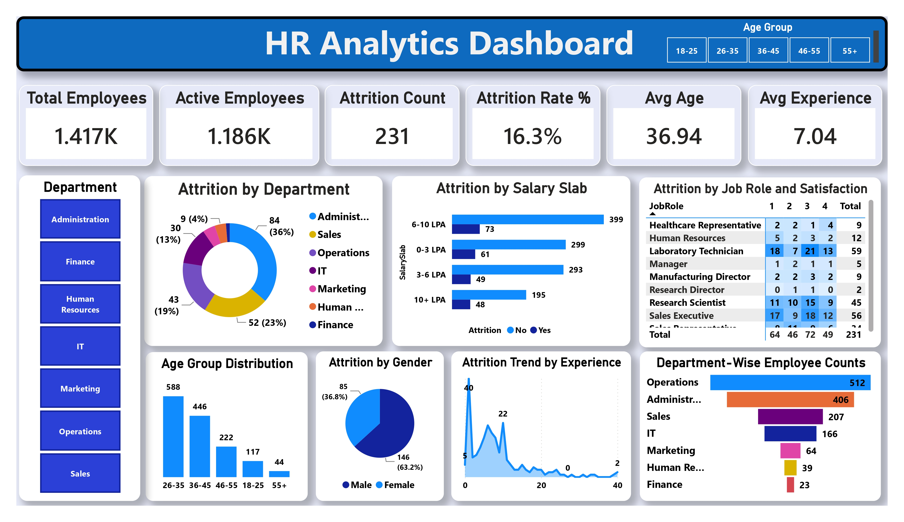

# HR Analytics Dashboard | Power BI

## 📌 Project Overview

The HR Analytics Dashboard is an interactive Business Intelligence solution developed using Microsoft Power BI. It enables HR professionals to monitor workforce metrics, analyze employee attrition, and gain actionable insights for data-driven decision-making.

The dashboard provides a comprehensive overview of employee demographics, departmental distribution, salary analysis, and attrition trends through interactive visualizations and filters.

---

## 📊 Dashboard Preview





---

## 🎯 Objectives

- Analyze the overall workforce distribution.
- Monitor employee attrition and retention.
- Identify departments with higher attrition.
- Analyze employee demographics.
- Study attrition trends across salary groups and experience levels.
- Support HR decision-making through interactive reports.

---

## 📈 Key Performance Indicators (KPIs)

- 👥 Total Employees
- ✅ Active Employees
- ❌ Attrition Count
- 📉 Attrition Rate (%)
- 🎂 Average Employee Age
- 💼 Average Employee Experience

---

## 📊 Dashboard Features

### Employee Overview
- Total Employee Count
- Active Employee Count
- Attrition Count
- Attrition Rate

### Employee Demographics
- Age Group Distribution
- Average Employee Age
- Attrition by Gender

### Department Analysis
- Department-wise Employee Count
- Attrition by Department

### Salary Analysis
- Attrition by Salary Slab

### Experience Analysis
- Attrition Trend by Experience

### Job Satisfaction Analysis
- Job Role vs Satisfaction Matrix

### Interactive Filters
- Department Filter
- Age Group Filter

---

## 🛠 Tools & Technologies

- Microsoft Power BI
- Power Query
- DAX (Data Analysis Expressions)
- Microsoft Excel

---

## 📂 Project Structure

```
HR-Analytics-PowerBI-Dashboard
│
├── Dashboard
│   └── HR_Analytics_Dashboard.pbix
│
├── Dataset
│   └── HR_Employee_Data.xlsx
│
├── Images
│   └── dashboard.png
│
└── README.md
```

---

## 💡 Key Insights

- Analyze the current active workforce.
- Monitor employee attrition across departments.
- Compare attrition based on salary slabs.
- Understand workforce distribution across age groups.
- Track attrition trends by employee experience.
- Evaluate employee satisfaction across different job roles.
- Support HR strategy using interactive business intelligence.

---


